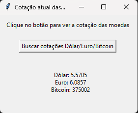

# Currency App
The app retrieves information about the exchange rates for the dollar, euro, and bitcoin, displaying it in a graphical interface.

To run the application, you need to install the dependencies listed in the requirements.txt file within a Python virtual environment. Then, you run the cotacao.py script.

Alternatively, you can simply download CurrencyBRL as an executable on [releases](https://github.com/maiconwa/CurrencyBRL/releases).

How to run:

Create a virtual environment with: 

    python -m venv venv

Activate the virtual environment with:

Windows venv activation

In cmd.exe

    venv\Scripts\activate.bat

In PowerShell

    venv\Scripts\Activate.ps1

Linux and MacOS venv activation

    $ source myvenv/bin/activate

Install requirements.txt with:

    pip install -r .\requirements.txt

Run the script cotacao.py.

 

 
