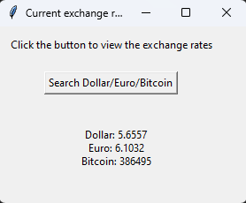

# Aplicativo de cotação 
Aplicativo busca informações sobre cotação do dolar, euro e bitcoin e exibe em uma interface gráfica.

Para executar a aplicação é necessário instalar as dependencias do arquivo requirements.txt em um ambiente virtual criado pelo interpretador do python e compilar o script cotacao.py ou executar o arquivo cotacao.exe disponivel na pasta dist.

Observação: Ao executar o cotacao.exe é possivel que a execução seja barrada pelo antivirius, pois é um app não assinado. Neste caso basta liberar a exeção de execução.

 

 
